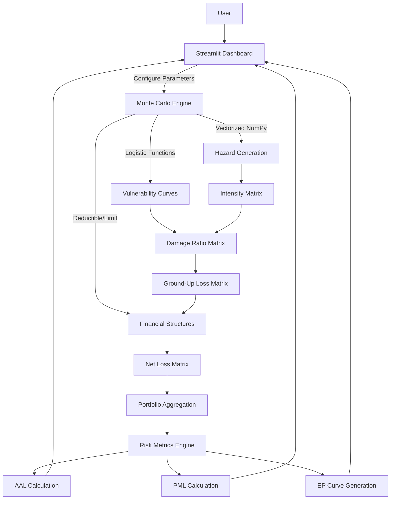
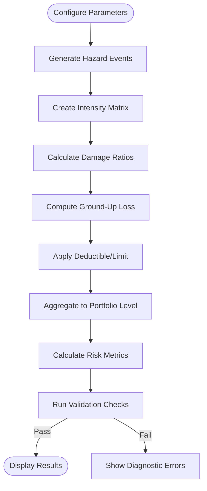
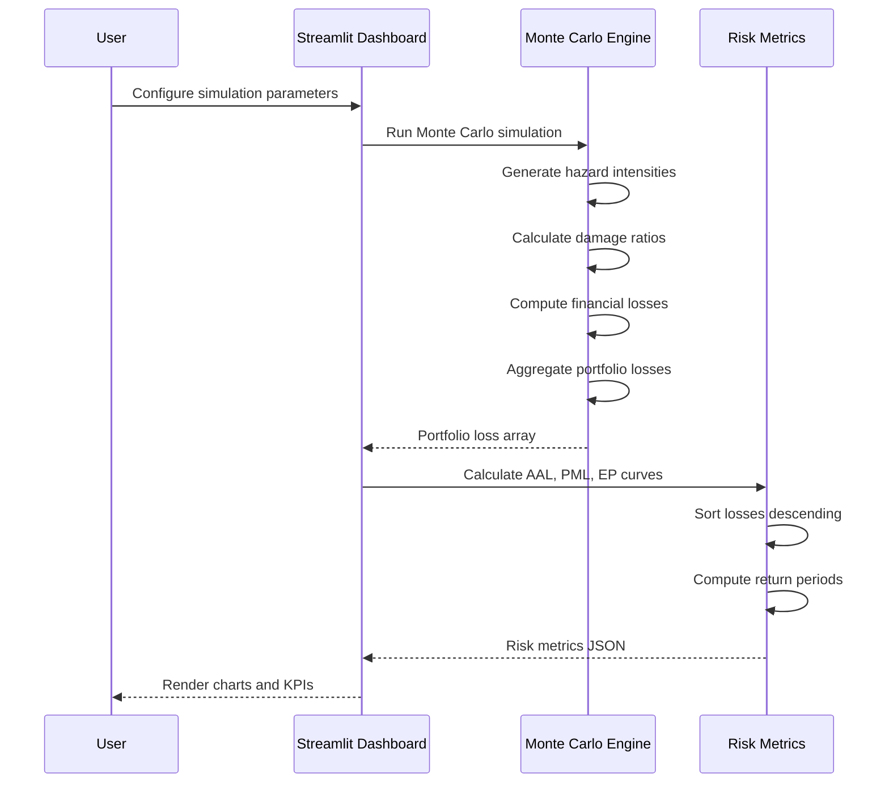

# CATALYST RISK

A high-performance, stochastic catastrophe risk modeling platform built in Python. Designed for quantitative risk analysts and reinsurance professionals, it allows users to run thousands of Monte Carlo simulations to estimate expected and tail financial losses across a geographically distributed property portfolio.

The app combines Streamlit, NumPy, Plotly, and scientific Python libraries to deliver enterprise-grade catastrophe modeling capabilities. Every simulation is mathematically rigorous, deterministic, and fully reproducible, so the core engineering focus is **vectorized performance**, **mathematical integrity**, and **auditability**.

---

## Screenshots

**Overview Dashboard**
*Dashboard showing portfolio KPIs, loss distribution, and exceedance probability curves*

**Risk Simulation**
*Monte Carlo parameter controls with real-time execution and audit trail export*

**Geographic Risk**
*Spatial distribution heatmap with property-level risk concentration visualization*

---

## Key Features

### Vectorized Monte Carlo Engine

Simulate 10,000+ stochastic hazard scenarios across hundreds of properties in sub-second speeds using pure NumPy tensor operations. No Python loops in the core simulation — all calculations use matrix broadcasting and outer products for maximum performance.

### Stochastic Hazard Modeling

Hazard events are generated using log-normal distributions to capture the long-tail nature of disaster severities. Multiple hazard types (windstorm, flood, earthquake, wildfire) with configurable severity levels and annual event rates.

### Building-Specific Vulnerability Curves

Each construction type (Concrete, Wood, Steel, Masonry) has a unique logistic vulnerability curve with tunable parameters (midpoint, steepness, cap). This models realistic structural response to hazard intensity.

### Financial Structure Modeling

Insurance policies are modeled with deductibles and limits. Ground-up loss is calculated as TIV × damage ratio, then transformed to net loss through deductible/limit application. All financial calculations are validated for mathematical correctness.

### Risk Metrics Engine

Real-time calculation of industry-standard catastrophe metrics:
- **AAL (Average Annual Loss)**: Mean of all simulation losses
- **PML (Probable Maximum Loss)**: Loss at specific return periods (100-year, 250-year)
- **EP (Exceedance Probability) Curves**: Probability of exceeding loss thresholds

### Sensitivity Analysis

Built-in parameter sweep logic to test model sensitivity. Users can vary hazard intensity, vulnerability curves, and financial structures to understand how parameter uncertainty affects risk metrics.

### Audit Trail System

Every simulation run generates a unique run ID with exact seed tracking. Configuration snapshots, runtime metrics, and results are exported as downloadable JSON for full reproducibility and regulatory compliance.

### Model Validation

Comprehensive diagnostic checks ensure mathematical correctness: net loss cannot exceed limit, net loss cannot be negative, ground-up loss must be ≥ net loss, and all values must be finite.

### Geographic Analysis

Spatial distribution visualization with multiple map layers (expected loss, TIV, loss ratio). Local intensity variation simulation approximates GIS-based hazard exposure for performance.

---

## System Architecture



---

## Monte Carlo Simulation Flow



---

## Risk Metrics Calculation Flow



---

## Core Modules

| Area | Responsibility |
| --- | --- |
| `src/simulation.py` | Vectorized Monte Carlo engine with matrix operations |
| `src/hazard.py` | Stochastic hazard event generation (log-normal distributions) |
| `src/vulnerability.py` | Building-specific logistic vulnerability curves |
| `src/loss.py` | Financial structure calculations (deductible, limit, GUL, net loss) |
| `src/metrics.py` | AAL, PML, and EP curve calculations |
| `src/geospatial.py` | Geographic data processing and map visualization |
| `src/sensitivity.py` | Parameter sweep and sensitivity analysis |
| `src/validation.py` | Diagnostic checks and mathematical bounds verification |
| `src/config.py` | Global configuration and model parameters |
| `src/exposure.py` | Portfolio data loading and validation |
| `src/reporting.py` | Audit trail generation and CSV export |
| `ui/styles.py` | Custom CSS injection for fintech-style UI |
| `ui/charts.py` | Plotly chart configurations and styling |
| `app.py` | Streamlit routing and UI state management |

---

## Data Model

```text
Exposure Data (CSV)
├── date
├── ticker
├── asset_class
├── quantity
└── price

Simulation Results (In-Memory)
├── run_id
├── num_sims
├── runtime_sec
├── portfolio_net_losses[]
├── portfolio_gul_losses[]
├── event_intensities[]
├── property_mean_loss[]
└── total_tiv

Vulnerability Parameters
├── building_type
├── mid (intensity at half-cap damage)
├── k (curve steepness)
└── cap (maximum damage ratio)
```

---

## Portfolio Calculations

**Damage Ratio (Logistic Function)**
```
damage_ratio = cap / (1 + exp(-k × (intensity - mid)))

   mid  = intensity at which damage is half of cap
   k    = steepness of the curve
   cap  = maximum mean damage ratio
```

**Ground-Up Loss**
```
gul = tiv × damage_ratio
   e.g. $1,000,000 × 0.45 = $450,000
```

**Net Loss**
```
net_loss = min(max(gul - deductible, 0), limit)
   e.g. min(max($450,000 - $25,000, 0), $750,000) = $425,000
```

**Average Annual Loss (AAL)**
```
aal = mean(portfolio_losses)
   e.g. mean([$0, $0, $45,000, ..., $2,500,000]) = $125,000
```

**Probable Maximum Loss (PML)**
```
pml = sorted_losses[floor(num_sims / return_period)]

   100-year PML = loss at 1% annual probability
   250-year PML = loss at 0.4% annual probability
```

**Exceedance Probability (EP) Curve**
```
probability = rank / total_simulations
return_period = 1 / probability
```

---

## Tech Stack

| Category | Technologies | Purpose |
| --- | --- | --- |
| Frontend | Streamlit, Plotly, Custom CSS | Interactive dashboard UI |
| Computation | NumPy, SciPy | Vectorized Monte Carlo simulations |
| Data | Pandas | Portfolio data manipulation |
| Visualization | Plotly, GeoPandas | Interactive charts and maps |
| Testing | Pytest | Unit tests for mathematical correctness |
| Deployment | Render.yaml, Docker | Cloud deployment configuration |

---

## Repository Structure

```text
catalyst-risk/
├── app.py                          # Streamlit entry point
├── requirements.txt                # Python dependencies
├── render.yaml                     # Render deployment config
├── src/
│   ├── config.py                   # Global configuration
│   ├── exposure.py                 # Data loading and validation
│   ├── simulation.py               # Monte Carlo engine
│   ├── hazard.py                   # Hazard generation
│   ├── vulnerability.py            # Vulnerability curves
│   ├── loss.py                     # Financial calculations
│   ├── metrics.py                  # Risk metrics engine
│   ├── geospatial.py               # Geographic analysis
│   ├── sensitivity.py              # Sensitivity analysis
│   ├── validation.py               # Diagnostic checks
│   └── reporting.py                # Audit trails and exports
├── ui/
│   ├── styles.py                   # Custom CSS injection
│   └── charts.py                   # Plotly chart configurations
├── data/
│   ├── generate_sample.py          # Synthetic data generator
│   └── sample_exposure.csv         # Demo portfolio data
├── tests/
│   └── test_*.py                   # Unit tests
├── notebooks/
│   └── Catalyst_Risk_Comprehensive_Guide.ipynb  # Technical guide
└── docs/                           # Additional documentation
```

---

## Setup & Installation

### 1. Clone the repository
```bash
git clone https://github.com/Shreyansh123185655/catalyst-risk.git
cd catalyst-risk
```

### 2. Create a virtual environment
```bash
python -m venv venv
source venv/bin/activate  # On Windows: venv\Scripts\activate
```

### 3. Install dependencies
```bash
pip install -r requirements.txt
```

### 4. Generate synthetic demo data
```bash
python data/generate_sample.py
```

### 5. Launch the application
```bash
streamlit run app.py
```

Open http://localhost:8501 in your browser.

---

## Quick Start Demo

1. **Navigate to "Overview Dashboard"** to see portfolio KPIs
2. **Go to "Risk Simulation"** to configure and run Monte Carlo simulations
3. **Adjust parameters**: number of simulations, hazard type, severity, event frequency
4. **Click "RUN SIMULATION"** to execute the stochastic model
5. **View results**: loss distribution, EP curve, portfolio metrics
6. **Download audit trail** for reproducibility and compliance

---

## Simulation Parameters

| Parameter | Options | Description |
| --- | --- | --- |
| **Number of Simulations** | 1,000 / 5,000 / 10,000 / 20,000 / 50,000 | Monte Carlo sample size |
| **Hazard Type** | Windstorm / Flood / Earthquake / Wildfire | Catastrophe event type |
| **Severity** | Low / Moderate / High / Extreme | Event magnitude multiplier |
| **Annual Event Rate** | 0.05 / 0.10 / 0.20 / 0.50 | Probability of event occurrence per year |
| **Random Seed** | Any integer | Reproducibility control |
| **Vulnerability Shift** | 0.5 - 1.5 | Adjust building resistance |
| **Deductible Multiplier** | 0.0 - 2.0 | Scale policy deductibles |
| **Limit Multiplier** | 0.5 - 2.0 | Scale policy limits |

---

## Risk Metrics Explained

### AAL (Average Annual Loss)
The expected loss per year based on all simulation outcomes. Used for insurance pricing and premium calculation.

### PML (Probable Maximum Loss)
The loss amount that has a specific probability of being exceeded in a given year:
- **100-Year PML**: 1% annual probability of exceedance
- **250-Year PML**: 0.4% annual probability of exceedance

Used for capital reserving and tail risk assessment.

### EP Curve (Exceedance Probability)
Shows the relationship between loss amounts and their probability of exceedance. The classic log-linear plot used in catastrophe modeling.

---

## Design Notes

### Why use vectorized NumPy instead of loops?

Monte Carlo simulations require running thousands of scenarios across hundreds of properties. Python loops would be prohibitively slow. NumPy's vectorized operations use C-level optimizations and can perform matrix operations in parallel. A nested loop would take minutes; vectorized NumPy takes sub-seconds.

### Why use logistic vulnerability curves?

Logistic functions create realistic S-shaped curves that model how buildings respond to hazard intensity. They capture the non-linear relationship where damage increases slowly at low intensities, accelerates at medium intensities, and saturates at high intensities.

### Why compute metrics server-side?

Centralizing calculations in the backend ensures mathematical consistency. The frontend only displays numbers from a single source of truth, preventing drift between different clients and enabling the same logic to be reused for APIs, batch processing, or mobile clients.

### Why use log-normal distributions for hazard intensity?

Natural disasters have long-tail distributions — most events are small, but extreme events occur more frequently than a normal distribution would predict. Log-normal distributions capture this asymmetry and cannot produce negative intensities.

---

## Future Roadmap

### Performance
GPU acceleration with CuPy for larger portfolios, distributed computing with Dask/Ray for millions of properties, spatial indexing for GIS-based hazard calculations.

### Modeling
Multi-peril modeling (correlated hazards), time-dependent vulnerability, inflation indexing, demand surge modeling, business interruption coverage.

### Validation
Back-testing against historical events, benchmarking against industry models, stress testing with extreme scenarios, model uncertainty quantification.

### Infrastructure
FastAPI backend for API access, PostgreSQL for portfolio persistence, Redis for caching, CI/CD pipeline, automated testing, structured logging.

### UI/UX
Real-time streaming results, scenario comparison, portfolio optimization, custom report generation, multi-user collaboration.

---

## Why This Project Matters

This repository demonstrates patterns used in real catastrophe modeling platforms:

- **Vectorized performance engineering** for large-scale stochastic simulations
- **Mathematical rigor** with proper vulnerability curves and financial structures
- **Auditability and reproducibility** with exact seed tracking and configuration snapshots
- **Industry-standard metrics** (AAL, PML, EP curves) used in insurance and reinsurance
- **Professional UI** mimicking tier-1 fintech interfaces (Palantir/Bloomberg)
- **Modular architecture** enabling extension to additional hazard types and financial structures

It shows a quantitative risk modeling system built the way a production platform would be structured, scaled down to a demonstrable scope while maintaining mathematical integrity and performance.

---

## Additional Resources

- **Technical Guide**: `notebooks/Catalyst_Risk_Comprehensive_Guide.ipynb` - Deep dive into mathematical foundations with 8 interactive visualizations
- **Documentation**: See `docs/` folder for quantitative methodology and architecture details
- **Tests**: Run `pytest` to verify mathematical correctness of validation checks
