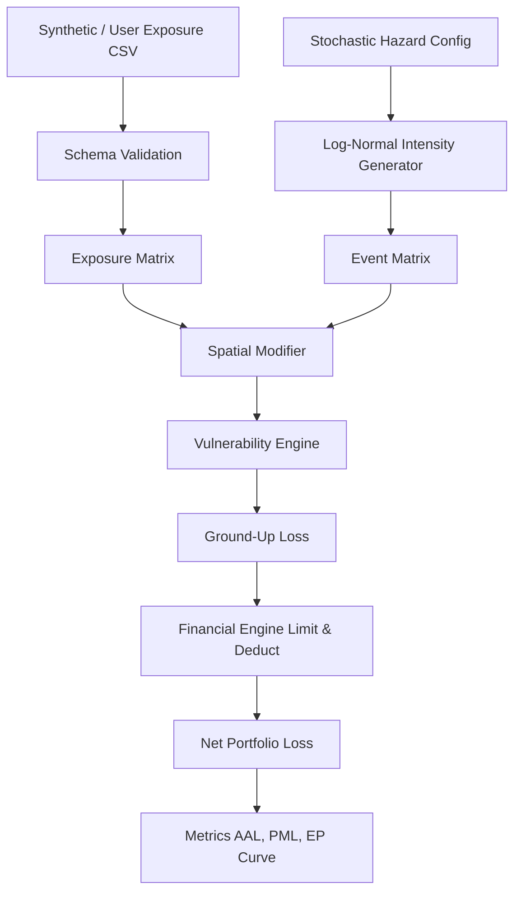

# CATALYST RISK - Architecture

## System Overview
The CATALYST RISK platform is a modular Python application built on three main layers:
1. **Core Risk Engine (Backend)**: Uses highly optimized, vectorized `NumPy` operations to simulate stochastic hazard intensities, intersect them with vulnerability models, and apply complex financial rules (deductibles/limits).
2. **Data & Spatial Layer**: Leverages `Pandas` and `GeoPandas` (optional for local/demo runs) to process physical exposure data and align geospatial intersections.
3. **Presentation Layer (Frontend)**: A customized `Streamlit` application with deep CSS overrides for a premium, tier-1 SaaS product aesthetic (inspired by Bloomberg/Palantir). It utilizes `Plotly` for interactive charting.

## Data Flow

## Why Vectorization?
Instead of looping over $N$ simulations and $M$ properties (which is computationally impossible in native Python for $N=10,000$ and $M=500$), the engine structures the simulation as cross-product tensor operations, generating a complete loss distribution in milliseconds.
